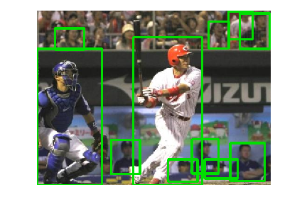

# Yolo with python

python から YOLO を実行するためのサンプルモジュールの実装です。

opencv-python の DNN から YOLO の重みと設定を読み込み、実行しています。

## Requirements

docker 及び docker-compose による環境作成を推奨しています。

## Quick Start

docker-compose をつかってコンテナを作成し立ち上げます

```bash
cp project.env .env
docker-compose up -d
```

## Sample

### 画像解析

[localhost:4004](http://localhost:4004/tree/notebooks) へアクセスして jupyter へログインします. (password は dolphin です)

`~/notebooks/sample` に実行サンプルが載っています

解析結果


### 動画解析

動画解析のサンプルが `movie_person_detection.py` に用意されています

```bash
$ docker exec -it yolo-with-python-app bash

# 以下はコンテナ内で実行

$ python movie_person_detection.py -h
usage: movie person detection [-h] -f FILE

optional arguments:
  -h, --help            show this help message and exit
  -f FILE, --file FILE
```

サンプル用の動画で解析

```bash
$ python movie_person_detection.py -f /home/sample/sample_movie.mp4

# 中略
[INFO video-stream] 2018-10-24 09:50:24,323: save to /home/sample/output_frames/frame_01202.png
[INFO video-stream] 2018-10-24 09:50:24,354: finished
[INFO video-stream] 2018-10-24 09:50:24,355: 0.917 [sec/frame]
```
